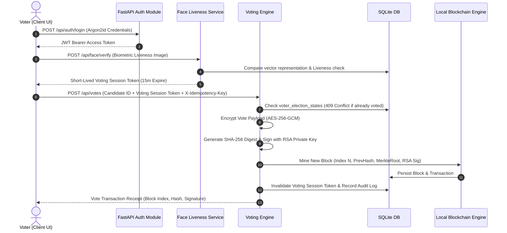

# System Architecture Specification

## SecureVote Trust Architecture

This document describes the technical design, data flows, and component interactions of the **Blockchain Voting with Face Authentication** platform.

## Component Architecture

1. **Frontend**: React 19 + TanStack Router + TailwindCSS.
2. **Backend**: FastAPI (Python 3.10+) running Uvicorn.
3. **Database**: SQLite with SQLAlchemy ORM.
   - Enforces `VoterElectionState` composite unique constraint `(voter_id, election_id)`.
4. **Biometric Vault**: Facial landmark vector processing with MediaPipe/OpenCV liveness detection.
   - Face embeddings and raw images are NEVER returned in API responses or written to logs.
5. **Local Blockchain Engine**:
   - Monotonic persistent ledger with deterministic Genesis block.
   - SHA-256 transaction digests, Merkle root calculation, RSA 2048-bit Digital Signatures.
6. **Audit Trail**: Tamper-evident immutable audit log stream with previous/current hash chaining.
